# crumbler

A lightweight Go CLI tool for agentic software development lifecycle automation (SDLC) with zero dependencies.

**Important:** `crumbler` is **exclusively** a state machine manager. It does NOT generate document content (PRD, ERD, README.md content). The AI agent is responsible for populating document content. `crumbler` only:
- Manages state transitions (open → closed, open → done)
- Manages goal state transitions (goals are numbered, named, and marked open/closed)
- Enforces valid state transitions (prevents invalid transitions)
- Creates directory structure and empty files
- Validates state machine integrity
- Reports errors with specific file paths (relative to project root)

## Agent Loop Flowchart

```mermaid
flowchart TD
    subgraph Human
        R[("📋 Roadmap<br/>(Human Authored)")]
    end

    subgraph Agent Loop
        START((Agent Start)) --> CHECK_PHASE
        
        %% Phase level
        CHECK_PHASE{Open Phase<br/>exists?}
        CHECK_PHASE -->|No| ROADMAP_DONE{Roadmap<br/>complete?}
        ROADMAP_DONE -->|Yes| EXIT((✅ Done))
        ROADMAP_DONE -->|No| CREATE_PHASE[Create Next Phase]
        CREATE_PHASE --> CHECK_PHASE
        
        CHECK_PHASE -->|Yes| CHECK_SPRINT
        
        %% Sprint level
        CHECK_SPRINT{Open Sprint<br/>exists?}
        CHECK_SPRINT -->|No| PHASE_DONE{Phase goals<br/>met?}
        PHASE_DONE -->|Yes| CLOSE_PHASE[Close Phase]
        CLOSE_PHASE --> CHECK_PHASE
        PHASE_DONE -->|No| CREATE_SPRINT[Create Sprint<br/>PRD + ERD]
        CREATE_SPRINT --> CHECK_SPRINT
        
        CHECK_SPRINT -->|Yes| CHECK_TICKETS
        
        %% Ticket level
        CHECK_TICKETS{Open Tickets<br/>exist?}
        CHECK_TICKETS -->|No| SPRINT_DONE{Sprint goals<br/>met?}
        SPRINT_DONE -->|Yes| CLOSE_SPRINT[Close Sprint]
        CLOSE_SPRINT --> CHECK_SPRINT
        SPRINT_DONE -->|No| CREATE_TICKETS[Decompose into<br/>Tickets]
        CREATE_TICKETS --> CHECK_TICKETS
        
        CHECK_TICKETS -->|Yes| EXECUTE
        
        %% Execution
        EXECUTE[Execute Ticket]
        EXECUTE --> TICKET_DONE{Ticket<br/>complete?}
        TICKET_DONE -->|No| EXECUTE
        TICKET_DONE -->|Yes| MARK_DONE[Mark Ticket Done]
        MARK_DONE --> CHECK_TICKETS
    end

    R -.->|Input| START

    %% Styling
    style R fill:#4a5568,stroke:#2d3748,color:#fff
    style EXIT fill:#48bb78,stroke:#2f855a,color:#fff
    style CREATE_PHASE fill:#4299e1,stroke:#2b6cb0,color:#fff
    style CREATE_SPRINT fill:#4299e1,stroke:#2b6cb0,color:#fff
    style CREATE_TICKETS fill:#4299e1,stroke:#2b6cb0,color:#fff
    style CLOSE_PHASE fill:#ed8936,stroke:#c05621,color:#fff
    style CLOSE_SPRINT fill:#ed8936,stroke:#c05621,color:#fff
    style EXECUTE fill:#9f7aea,stroke:#6b46c1,color:#fff
    style MARK_DONE fill:#48bb78,stroke:#2f855a,color:#fff
```



## State Machine Hierarchy


## Project Structure

`crumbler` operates on the current working directory (pwd) where it's invoked. It manages project state in a `.crumbler/` directory at the project root using a tree-friendly, file-based structure:

```
your-project/
├── .crumbler/                    # crumbler state directory (created on init)
│   ├── README.md                 # project overview
│   ├── roadmap.md                # current roadmap (markdown)
│   ├── phases/                   # all phases
│   │   ├── 0001-phase/            # phase directory
│   │   │   ├── open              # empty file = phase is open
│   │   │   ├── closed            # empty file = phase is closed (mutually exclusive with open)
│   │   │   ├── README.md         # phase description (AI populates)
│   │   │   ├── goals/            # phase goals
│   │   │   │   ├── 0001-goal/     # goal directory
│   │   │   │   │   ├── name      # file containing goal name (AI populates)
│   │   │   │   │   ├── open      # empty file = goal is open
│   │   │   │   │   └── closed    # empty file = goal is closed (mutually exclusive with open)
│   │   │   └── sprints/          # sprints in this phase
│   │   │       ├── 0001-sprint/
│   │   │       │   ├── open      # empty file = sprint is open
│   │   │       │   ├── closed    # empty file = sprint is closed
│   │   │       │   ├── README.md # sprint description (AI populates)
│   │   │       │   ├── PRD.md    # Product Requirements Document (AI populates)
│   │   │       │   ├── ERD.md    # Entity Relationship Diagram (AI populates)
│   │   │       │   ├── goals/    # sprint goals
│   │   │       │   └── tickets/  # tickets in this sprint
│   │   │       │       ├── 0001-ticket/
│   │   │       │       │   ├── open      # empty file = ticket is open
│   │   │       │       │   ├── done      # empty file = ticket is done
│   │   │       │       │   ├── README.md # ticket description (AI populates)
│   │   │       │       │   └── goals/    # ticket goals
│   │   │       │       │       └── 0001-goal/
│   │   │       │       │           ├── name
│   │   │       │       │           ├── open
│   │   │       │       │           └── closed
│   │   └── 0002-phase/
│   │       └── ...
│   └── roadmaps/                 # roadmap templates/archives
│       └── example-roadmap.md
├── your-code/
└── ...
```

**State Management:**
- **Status = empty files**: `open`, `closed`, `done` are empty files created with `touch` and removed with `delete`
- **Goals = numbered directories**: Goals are stored in `goals/XXXX-goal/` directories with `name` file (AI populates) and `open`/`closed` status files
- **All docs = markdown**: README.md, PRD.md, ERD.md, roadmap.md (AI populates content, crumbler only creates structure)
- **Goal names = text files**: Goal names are stored in `goals/XXXX-goal/name` file (AI populates content, crumbler only creates structure)
- **Tree-friendly**: Directory structure represents hierarchy, perfect for `tree` command
- **Agent-friendly**: Agents can read markdown, check file existence for state, navigate directory structure
- **State machine enforcement**: crumbler validates and enforces valid state transitions, errors with file paths on invalid states

**State Transition Rules:**
- Phase: `open` ↔ `closed` (mutually exclusive)
- Sprint: `open` ↔ `closed` (mutually exclusive)
- Ticket: `open` ↔ `done` (mutually exclusive)
- Goals (Phase/Sprint/Ticket): `open` ↔ `closed` (mutually exclusive, same rules apply at all levels)
- Invalid transitions are forbidden and error with specific file paths
- **Goals Met Logic**: A phase/sprint/ticket's goals are met when all its goals have `closed` file (no `open` file)

**Hierarchy Constraints:**
- Cannot close phase with open sprints or open phase goals
- Cannot close sprint with open tickets or open sprint goals
- Cannot mark ticket done with open ticket goals

## Installation

### From Source

```bash
git clone https://github.com/waynenilsen/crumbler.git
cd crumbler
go build -o crumbler
```

### Using Go Install

```bash
go install github.com/waynenilsen/crumbler@latest
```

## Usage

`crumbler` operates on the current working directory. Navigate to your project directory and run:

```bash
cd /path/to/your-project
crumbler init                    # Initialize crumbler in this directory
crumbler roadmap load roadmap.md # Load roadmap
crumbler get-next-prompt         # Generate AI agent prompt based on current state
crumbler status                  # Show current project state
```

### Key Commands

- `crumbler init` - Initialize a new crumbler project
- `crumbler status` - Show current state of the project
- `crumbler phase create` - Create next phase from roadmap
- `crumbler sprint create` - Create sprint in current phase
- `crumbler ticket create` - Create ticket in current sprint
- `crumbler get-next-prompt` - Generate AI agent prompt based on current state
- `crumbler help <command>` - Show detailed help for any command

### Naming Conventions

- All numbering uses 4-digit zero-padded format (e.g., `0001`, `0002`, `0010`, `0100`)
- All file and folder names use kebab-case
- Numbers come before kebab names (e.g., `0001-phase`, `0001-sprint`, `0001-goal`, `0001-ticket`)

### Error Messages

All errors include file paths relative to project root (e.g., `.crumbler/phases/0001-phase/open`) to help identify exactly which files are causing state machine violations.

## Building

```bash
go build -o crumbler
```

## Development

```bash
go run main.go
```

## License

MIT
