```mermaid
flowchart TD
    subgraph Human
        R[("📋 Roadmap<br/>(Human Authored)")]
    end

    subgraph Agent Loop
        START((Agent Start)) --> CHECK_PHASE
        
        %% Phase level
        CHECK_PHASE{Open Phase<br/>exists?}
        CHECK_PHASE -->|No| ROADMAP_DONE{Roadmap<br/>complete?}
        ROADMAP_DONE -->|Yes| EXIT((✅ Done))
        ROADMAP_DONE -->|No| CREATE_PHASE[Create Next Phase]
        CREATE_PHASE --> CHECK_PHASE
        
        CHECK_PHASE -->|Yes| CHECK_SPRINT
        
        %% Sprint level
        CHECK_SPRINT{Open Sprint<br/>exists?}
        CHECK_SPRINT -->|No| PHASE_DONE{Phase goals<br/>met?}
        PHASE_DONE -->|Yes| CLOSE_PHASE[Close Phase]
        CLOSE_PHASE --> CHECK_PHASE
        PHASE_DONE -->|No| CREATE_SPRINT[Create Sprint<br/>PRD + ERD]
        CREATE_SPRINT --> CHECK_SPRINT
        
        CHECK_SPRINT -->|Yes| CHECK_TICKETS
        
        %% Ticket level
        CHECK_TICKETS{Open Tickets<br/>exist?}
        CHECK_TICKETS -->|No| SPRINT_DONE{Sprint goals<br/>met?}
        SPRINT_DONE -->|Yes| CLOSE_SPRINT[Close Sprint]
        CLOSE_SPRINT --> CHECK_SPRINT
        SPRINT_DONE -->|No| CREATE_TICKETS[Decompose into<br/>Tickets]
        CREATE_TICKETS --> CHECK_TICKETS
        
        CHECK_TICKETS -->|Yes| EXECUTE
        
        %% Execution
        EXECUTE[Execute Ticket]
        EXECUTE --> TICKET_DONE{Ticket<br/>complete?}
        TICKET_DONE -->|No| EXECUTE
        TICKET_DONE -->|Yes| MARK_DONE[Mark Ticket Done]
        MARK_DONE --> CHECK_TICKETS
    end

    R -.->|Input| START

    %% Styling
    style R fill:#4a5568,stroke:#2d3748,color:#fff
    style EXIT fill:#48bb78,stroke:#2f855a,color:#fff
    style CREATE_PHASE fill:#4299e1,stroke:#2b6cb0,color:#fff
    style CREATE_SPRINT fill:#4299e1,stroke:#2b6cb0,color:#fff
    style CREATE_TICKETS fill:#4299e1,stroke:#2b6cb0,color:#fff
    style CLOSE_PHASE fill:#ed8936,stroke:#c05621,color:#fff
    style CLOSE_SPRINT fill:#ed8936,stroke:#c05621,color:#fff
    style EXECUTE fill:#9f7aea,stroke:#6b46c1,color:#fff
    style MARK_DONE fill:#48bb78,stroke:#2f855a,color:#fff
```

# crumbler

A lightweight Go CLI tool for agentic software development lifecycle automation (SDLC) with zero dependencies.

**Important:** `crumbler` is **exclusively** a state machine manager. It does NOT generate document content (PRD, ERD, README.md content). The AI agent is responsible for populating document content. `crumbler` only:
- Manages state transitions (open → closed, open → done)
- Manages goal state transitions (goals are numbered, named, and marked open/closed)
- Enforces valid state transitions (prevents invalid transitions)
- Creates directory structure and empty files
- Validates state machine integrity
- Reports errors with specific file paths (relative to project root)

## Project Structure

`crumbler` operates on the current working directory (pwd) where it's invoked. It manages project state in a `.crumbler/` directory at the project root using a tree-friendly, file-based structure:

```
your-project/
├── .crumbler/                    # crumbler state directory (created on init)
│   ├── README.md                 # project overview
│   ├── roadmap.md                # current roadmap (markdown)
│   ├── phases/                   # all phases
│   │   ├── 0001-phase/            # phase directory
│   │   │   ├── open              # empty file = phase is open
│   │   │   ├── closed            # empty file = phase is closed (mutually exclusive with open)
│   │   │   ├── README.md         # phase description (AI populates)
│   │   │   ├── goals/            # phase goals
│   │   │   │   ├── 0001-goal/     # goal directory
│   │   │   │   │   ├── name      # file containing goal name (AI populates)
│   │   │   │   │   ├── open      # empty file = goal is open
│   │   │   │   │   └── closed    # empty file = goal is closed (mutually exclusive with open)
│   │   │   │   └── 0002-goal/
│   │   │   │       └── ...
│   │   │   └── sprints/          # sprints in this phase
│   │   │       ├── 0001-sprint/
│   │   │       │   ├── open      # empty file = sprint is open
│   │   │       │   ├── closed    # empty file = sprint is closed
│   │   │       │   ├── README.md # sprint description (AI populates)
│   │   │       │   ├── PRD.md    # Product Requirements Document (AI populates)
│   │   │       │   ├── ERD.md    # Entity Relationship Diagram (AI populates)
│   │   │       │   ├── goals/    # sprint goals
│   │   │       │   │   ├── 0001-goal/
│   │   │       │   │   │   ├── name
│   │   │       │   │   │   ├── open
│   │   │       │   │   │   └── closed
│   │   │       │   │   └── 0002-goal/
│   │   │       │   │       └── ...
│   │   │       │   └── tickets/  # tickets in this sprint
│   │   │       │       ├── 0001-ticket/
│   │   │       │       │   ├── open      # empty file = ticket is open
│   │   │       │       │   ├── done      # empty file = ticket is done
│   │   │       │       │   ├── README.md # ticket description (AI populates)
│   │   │       │       │   └── goals/    # ticket goals
│   │   │       │       │       ├── 0001-goal/
│   │   │       │       │       │   ├── name
│   │   │       │       │       │   ├── open
│   │   │       │       │       │   └── closed
│   │   │       │       │       └── 0002-goal/
│   │   │       │       │           └── ...
│   │   │       │       └── 0002-ticket/
│   │   │       │           └── ...
│   │   │       └── 0002-sprint/
│   │   │           └── ...
│   │   └── 0002-phase/
│   │       └── ...
│   └── roadmaps/                 # roadmap templates/archives
│       └── example-roadmap.md
├── your-code/
└── ...
```

**State Management:**
- **Status = empty files**: `open`, `closed`, `done` are empty files created with `touch` and removed with `delete`
- **Goals = numbered directories**: Goals are stored in `goals/XXXX-goal/` directories with `name` file (AI populates) and `open`/`closed` status files
- **All docs = markdown**: README.md, PRD.md, ERD.md, roadmap.md (AI populates content, crumbler only creates structure)
- **Goal names = text files**: Goal names are stored in `goals/XXXX-goal/name` file (AI populates content, crumbler only creates structure)
- **Tree-friendly**: Directory structure represents hierarchy, perfect for `tree` command
- **Agent-friendly**: Agents can read markdown, check file existence for state, navigate directory structure
- **State machine enforcement**: crumbler validates and enforces valid state transitions, errors with file paths on invalid states

**State Transition Rules:**
- Phase: `open` ↔ `closed` (mutually exclusive)
- Sprint: `open` ↔ `closed` (mutually exclusive)
- Ticket: `open` ↔ `done` (mutually exclusive)
- Goals (Phase/Sprint/Ticket): `open` ↔ `closed` (mutually exclusive, same rules apply at all levels)
- Invalid transitions are forbidden and error with specific file paths
- **Goals Met Logic**: A phase/sprint/ticket's goals are met when all its goals have `closed` file (no `open` file)

The tool is invoked from within a project directory and manages that project's SDLC state machine.

## Implementation Roadmap

This roadmap breaks down the flowchart into concrete, actionable implementation tasks.

### Phase 0: Project Foundation

- [ ] Initialize Go module (`go mod init github.com/yourusername/crumbler`)
- [ ] Create project structure (`main.go`, `internal/`, `cmd/`)
- [ ] Set up basic CLI with `flag` package
- [ ] Add help/usage output
- [ ] Create `.gitignore` for Go projects
- [ ] Add MIT license file

### Phase 1: Data Models & State Management

#### Core Data Structures
- [ ] Define `Roadmap` struct (phases list, metadata) - loaded from `.crumbler/roadmap.md`
- [ ] Define `Goal` struct (ID from dir name, path, name from `name` file, status from file existence)
- [ ] Define `Phase` struct (ID from dir name, path, goals list from `goals/` directory, status from file existence)
- [ ] Define `Sprint` struct (ID from dir name, path, goals list from `goals/` directory, PRD from PRD.md, ERD from ERD.md, status from file existence)
- [ ] Define `Ticket` struct (ID from dir name, path, goals list from `goals/` directory, description from README.md, status from file existence)
- [ ] Status determined by file existence: `open` file exists = open, `closed` file exists = closed, `done` file exists = done
- [ ] Goal name determined by reading `goals/XXXX-goal/name` file (AI populates, crumbler only reads)

#### File-Based State Persistence (Tree-Friendly)
- [ ] Implement `FindProjectRoot()` - locate `.crumbler/` directory (walk up from pwd), return relpath from pwd
- [ ] Implement `PathManager` - construct paths for phases/sprints/tickets/goals, return relpaths from project root
- [ ] Implement `StatusManager` - check status via file existence (`IsOpen(path)`, `IsClosed(path)`, `IsDone(path)`)
- [ ] Implement `StatusManager` - validate state before transitions (check for invalid states)
- [ ] Implement `StatusManager` - set status via `touch`/`delete` files with validation (`SetOpen(path)`, `SetClosed(path)`, `SetDone(path)`)
- [ ] Implement `GoalManager` - create goal directory (`goals/XXXX-goal/`), create `name` file, set initial status
- [ ] Implement `GoalManager` - read goal name from `goals/XXXX-goal/name` file
- [ ] Implement `GoalManager` - scan `goals/` directory to find all goals
- [ ] Implement `GoalManager` - check if all goals are closed (`AreAllGoalsClosed(path)`)
- [ ] Implement `StateValidator` - validate entire state machine (check for conflicts, invalid transitions)
- [ ] Implement `StateValidator` - return errors with specific file paths (relpath from project root)
- [ ] Implement directory scanning - find all phases/sprints/tickets/goals by scanning directories
- [ ] Create `.crumbler/` directory structure on init (phases/, roadmaps/)
- [ ] Handle case where tool is run outside a crumbler-managed project (error with clear message)
- [ ] Ensure all state operations are atomic (create temp files, then rename)
- [ ] All error messages must include file paths as relpaths from project root (e.g., `.crumbler/phases/0001-phase/open`)

### Phase 2: Roadmap Management

#### Roadmap Operations
- [ ] Implement `LoadRoadmap(path)` - read roadmap from markdown file (`.crumbler/roadmap.md` or external file)
- [ ] Define roadmap markdown format specification (phases as headers, goals as lists)
- [ ] Implement `ParseRoadmap(markdown)` - parse markdown into roadmap structure
- [ ] Implement `ValidateRoadmap(roadmap)` - check roadmap structure
- [ ] Implement `IsRoadmapComplete(roadmap, state)` - check if all phases have `closed` file
- [ ] Implement `SaveRoadmap(roadmap)` - write roadmap to `.crumbler/roadmap.md`
- [ ] Create example roadmap template (markdown format)

### Phase 3: Phase Management

#### Phase Operations
- [ ] Implement `GetOpenPhase(projectRoot)` - scan `.crumbler/phases/` for dir with `open` file (no `closed` file)
- [ ] Implement `GetNextPhaseIndex(roadmap, projectRoot)` - find next phase number to create (returns 4-digit zero-padded index)
- [ ] Implement `CreatePhase(roadmap, phaseIndex, projectRoot)` - create `.crumbler/phases/XXXX-phase/` directory (4-digit zero-padded, number before name)
- [ ] Implement `CreatePhase(roadmap, phaseIndex, projectRoot)` - create empty `README.md` file (AI will populate)
- [ ] Implement `CreatePhase(roadmap, phaseIndex, projectRoot)` - create `goals/` subdirectory
- [ ] Implement `CreatePhase(roadmap, phaseIndex, projectRoot)` - create `sprints/` subdirectory
- [ ] Implement `CreatePhase(roadmap, phaseIndex, projectRoot)` - `touch` `open` file
- [ ] Implement `ValidatePhaseState(phasePath)` - check for invalid state (both `open` and `closed` exist), return error with file paths
- [ ] Implement `GetPhaseGoals(phasePath)` - scan `goals/` directory, return list of goals
- [ ] Implement `CreatePhaseGoal(phasePath, goalIndex, goalName)` - create `goals/XXXX-goal/` directory (4-digit zero-padded, number before name), create `name` file with goalName, `touch` `open` file
- [ ] Implement `ClosePhaseGoal(phasePath, goalIndex)` - validate state, `delete` `open` file, `touch` `closed` file in goal directory
- [ ] Implement `ArePhaseGoalsMet(phasePath)` - check if all phase goals have `closed` file AND all sprints have `closed` file. Returns false if no goals or sprints exist yet (allows CREATE_GOALS/CREATE_SPRINT in flowchart)
- [ ] Implement `ClosePhase(phasePath)` - validate state, `delete` `open` file, `touch` `closed` file, error if invalid transition
- [ ] Implement `ClosePhase(phasePath)` - error if sprints still open (return paths of open sprints)
- [ ] Implement `ClosePhase(phasePath)` - error if phase goals still open (return paths of open goals)
- [ ] All phase operations return errors with relpaths (e.g., `.crumbler/phases/0001-phase/open`)

### Phase 4: Sprint Management

#### Sprint Operations
- [ ] Implement `GetOpenSprint(phasePath)` - scan `sprints/` subdirectory for dir with `open` file (no `closed` file)
- [ ] Implement `GetNextSprintIndex(phasePath)` - find next sprint number to create (returns 4-digit zero-padded index)
- [ ] Implement `CreateSprint(phasePath, sprintIndex)` - create `sprints/XXXX-sprint/` directory (4-digit zero-padded, number before name)
- [ ] Implement `CreateSprint(phasePath, sprintIndex)` - create empty `README.md` file (AI will populate)
- [ ] Implement `CreateSprint(phasePath, sprintIndex)` - create empty `PRD.md` file (AI will populate)
- [ ] Implement `CreateSprint(phasePath, sprintIndex)` - create empty `ERD.md` file (AI will populate)
- [ ] Implement `CreateSprint(phasePath, sprintIndex)` - create `goals/` subdirectory
- [ ] Implement `CreateSprint(phasePath, sprintIndex)` - create `tickets/` subdirectory
- [ ] Implement `CreateSprint(phasePath, sprintIndex)` - `touch` `open` file
- [ ] Implement `ValidateSprintState(sprintPath)` - check for invalid state (both `open` and `closed` exist), return error with file paths
- [ ] Implement `GetSprintGoals(sprintPath)` - scan `goals/` directory, return list of goals
- [ ] Implement `CreateSprintGoal(sprintPath, goalIndex, goalName)` - create `goals/XXXX-goal/` directory (4-digit zero-padded, number before name), create `name` file with goalName, `touch` `open` file
- [ ] Implement `CloseSprintGoal(sprintPath, goalIndex)` - validate state, `delete` `open` file, `touch` `closed` file in goal directory
- [ ] Implement `AreSprintGoalsMet(sprintPath)` - check if all sprint goals have `closed` file AND all tickets have `done` file. Returns false if no goals or tickets exist yet (allows CREATE_GOALS/CREATE_TICKETS in flowchart)
- [ ] Implement `CloseSprint(sprintPath)` - validate state, `delete` `open` file, `touch` `closed` file, error if invalid transition
- [ ] Implement `CloseSprint(sprintPath)` - error if tickets still open (return paths of open tickets)
- [ ] Implement `CloseSprint(sprintPath)` - error if sprint goals still open (return paths of open goals)
- [ ] All sprint operations return errors with relpaths (e.g., `.crumbler/phases/0001-phase/sprints/0001-sprint/open`)

### Phase 5: Ticket Management

#### Ticket Operations
- [ ] Implement `GetOpenTickets(sprintPath)` - scan `tickets/` subdirectory for dirs with `open` file (no `done` file)
- [ ] Implement `GetNextTicketIndex(sprintPath)` - find next ticket number to create (returns 4-digit zero-padded index)
- [ ] Implement `CreateTicket(sprintPath, ticketIndex)` - create `tickets/XXXX-ticket/` directory (4-digit zero-padded, number before name)
- [ ] Implement `CreateTicket(sprintPath, ticketIndex)` - create empty `README.md` file (AI will populate)
- [ ] Implement `CreateTicket(sprintPath, ticketIndex)` - create `goals/` subdirectory
- [ ] Implement `CreateTicket(sprintPath, ticketIndex)` - `touch` `open` file
- [ ] Implement `ValidateTicketState(ticketPath)` - check for invalid state (both `open` and `done` exist), return error with file paths
- [ ] Implement `GetTicketGoals(ticketPath)` - scan `goals/` directory, return list of goals
- [ ] Implement `CreateTicketGoal(ticketPath, goalIndex, goalName)` - create `goals/XXXX-goal/` directory (4-digit zero-padded, number before name), create `name` file with goalName, `touch` `open` file
- [ ] Implement `CloseTicketGoal(ticketPath, goalIndex)` - validate state, `delete` `open` file, `touch` `closed` file in goal directory
- [ ] Implement `IsTicketComplete(ticketPath)` - check if `done` file exists AND all ticket goals have `closed` file
- [ ] Implement `MarkTicketDone(ticketPath)` - validate state, `delete` `open` file, `touch` `done` file, error if invalid transition
- [ ] Implement `MarkTicketDone(ticketPath)` - error if ticket goals still open (return paths of open goals)
- [ ] All ticket operations return errors with relpaths (e.g., `.crumbler/phases/0001-phase/sprints/0001-sprint/tickets/0001-ticket/open`)
- [ ] Note: AI is responsible for decomposing sprint into tickets, creating goals, and populating ticket README.md content

### Phase 6: Agent Loop Support (State Queries)

#### Note: Agent Loop is AI's Responsibility
- [ ] crumbler provides state query functions that AI calls to implement the flowchart logic
- [ ] AI agent implements the loop following the flowchart decision tree, crumbler provides state machine operations
- [ ] crumbler's `run` command can be a simple state query/validation tool, or AI can call crumbler functions directly
- [ ] The agent loop must follow the exact decision flow from the flowchart (see Decision Points section)

#### State Query Functions (for AI Agent)
- [ ] Implement query functions that AI can call to check state
- [ ] All query functions validate state and return errors with file paths on invalid states
- [ ] Query functions are read-only (don't modify state, just report it)
- [ ] Query functions must work together: when a "check exists" function returns false, agent must check corresponding "goals met" function to determine next action

#### Decision Points (from flowchart)

**Agent Loop Logic Flow:**
The flowchart requires these decision functions to work together. When a "check" function returns false, the agent must check the corresponding "goals met" function to determine the next action:

- **CHECK_PHASE flow:**
  - `OpenPhaseExists(projectRoot)` - returns true if any phase has `open` file (no `closed` file)
  - If false → check `RoadmapComplete(roadmap, projectRoot)`:
    - If true → EXIT (all done)
    - If false → CREATE_PHASE (create next phase from roadmap)

- **CHECK_SPRINT flow:**
  - `OpenSprintExists(phasePath)` - returns true if any sprint in phase has `open` file (no `closed` file)
  - If false → check `PhaseGoalsMet(phasePath)`:
    - If true → CLOSE_PHASE (all sprints closed AND all phase goals closed, phase goals met)
    - If false → check if phase goals exist:
      - If no goals exist → CREATE_GOALS (create phase goals)
      - If goals exist but not all closed → wait for goals to be closed
      - If no sprints exist → CREATE_SPRINT (create first sprint)

- **CHECK_TICKETS flow:**
  - `OpenTicketsExist(sprintPath)` - returns true if any ticket in sprint has `open` file (no `done` file)
  - If false → check `SprintGoalsMet(sprintPath)`:
    - If true → CLOSE_SPRINT (all tickets done AND all sprint goals closed, sprint goals met)
    - If false → check if sprint goals exist:
      - If no goals exist → CREATE_GOALS (create sprint goals)
      - If goals exist but not all closed → wait for goals to be closed
      - If no tickets exist → CREATE_TICKETS (decompose sprint into tickets)

- **TICKET_DONE decision:**
  - `TicketComplete(ticketPath)` - returns true if ticket has `done` file (no `open` file)
  - Used in execution loop to determine when to call `MarkTicketDone()`

**Implementation Requirements:**
- [ ] `OpenPhaseExists(projectRoot)` - scan for `open` file in phases/, validate no conflicts, return bool
- [ ] `RoadmapComplete(roadmap, projectRoot)` - check if all phases have `closed` file, validate state, return bool
- [ ] `PhaseGoalsMet(phasePath)` - check if all phase goals have `closed` file AND all sprints have `closed` file. Returns false if no goals or sprints exist yet
- [ ] `OpenSprintExists(phasePath)` - scan sprints/ for `open` file, validate no conflicts, return bool
- [ ] `SprintGoalsMet(sprintPath)` - check if all sprint goals have `closed` file AND all tickets have `done` file. Returns false if no goals or tickets exist yet
- [ ] `OpenTicketsExist(sprintPath)` - scan tickets/ for `open` file without `done`, validate state, return bool
- [ ] `TicketComplete(ticketPath)` - check if `done` file exists (no `open` file) AND all ticket goals have `closed` file, validate no conflicts, return bool
- [ ] `PhaseGoalsExist(phasePath)` - check if any goals exist in phase `goals/` directory, return bool
- [ ] `SprintGoalsExist(sprintPath)` - check if any goals exist in sprint `goals/` directory, return bool
- [ ] `TicketGoalsExist(ticketPath)` - check if any goals exist in ticket `goals/` directory, return bool
- [ ] All decision functions validate state and return errors with file paths on invalid states
- [ ] Note: `*GoalsMet` functions return false if no children exist yet (e.g., `SprintGoalsMet` returns false if no tickets exist, allowing CREATE_TICKETS)

### Phase 7: Ticket Execution

#### Execution Engine
- [ ] Note: crumbler does NOT execute tickets - AI agent executes tickets
- [ ] crumbler only manages state transitions (open → done)
- [ ] AI agent calls `MarkTicketDone()` when ticket execution completes
- [ ] crumbler validates state before allowing transition

### Phase 8: CLI Commands

#### Command Structure
- [ ] `crumbler init` - initialize `.crumbler/` in current directory (pwd)
- [ ] `crumbler run [roadmap-file]` - start agent loop (operates on pwd)
- [ ] `crumbler status` - show current state of project in pwd
- [ ] `crumbler phase list` - list all phases in current project
- [ ] `crumbler sprint list` - list sprints in current phase
- [ ] `crumbler ticket list` - list tickets in current sprint
- [ ] `crumbler roadmap load <file>` - load roadmap file into current project
- [ ] Detect if run outside managed project (error or auto-init)
- [ ] Add command help text for each command

#### Agent-Friendly Help Documentation (Critical for AI Agents)
- [ ] **Separate help docs per command level** - Each command and subcommand must have its own detailed help document to avoid context rot (e.g., `crumbler help`, `crumbler phase help`, `crumbler sprint help`, `crumbler ticket help`, `crumbler goal help`)
- [ ] **Top-level help** (`crumbler help` or `crumbler --help`):
  - [ ] Overview of crumbler's purpose (state machine manager, not content generator)
  - [ ] List all available commands and subcommands with brief descriptions
  - [ ] Explain project structure (`.crumbler/` directory, file-based state)
  - [ ] Show examples of common workflows
  - [ ] Link to subcommand help docs for detailed information
- [ ] **Command-level help** (e.g., `crumbler phase help`, `crumbler sprint help`):
  - [ ] Detailed explanation of the entity (phase, sprint, ticket, goal)
  - [ ] All available subcommands for that entity (list, create, close, etc.)
  - [ ] File paths where content should be written (with examples)
  - [ ] State transition rules specific to that entity
  - [ ] Examples of valid state transitions
  - [ ] Tips on CLI tools agents can use to create/edit content (e.g., `cat`, `echo`, `vim`, `nano`, file editors)
  - [ ] Examples showing exact file paths and content structure
- [ ] **Subcommand-level help** (e.g., `crumbler phase create help`, `crumbler sprint close help`):
  - [ ] Detailed explanation of what the subcommand does
  - [ ] Required and optional arguments/flags
  - [ ] Exact file paths that will be created/modified (relative to project root)
  - [ ] State validation rules enforced by this subcommand
  - [ ] Error conditions and what they mean
  - [ ] Examples of usage with real file paths
  - [ ] Tips on CLI tools for creating content in the files this subcommand creates
  - [ ] Examples of content structure (markdown format, file naming conventions)
- [ ] **Content creation guidance in help docs**:
  - [ ] For each entity type, specify which files AI should populate (README.md, PRD.md, ERD.md, `name` files)
  - [ ] Show exact file paths where content goes (e.g., `.crumbler/phases/0001-phase/README.md`)
  - [ ] Provide markdown format examples for each document type
  - [ ] Recommend CLI tools for content creation (`echo "content" > file.md`, `cat > file.md <<EOF`, etc.)
  - [ ] Show examples of valid content structure
  - [ ] Explain that crumbler only creates empty files/structure, AI must populate content
- [ ] **Help doc format requirements**:
  - [ ] Each help doc must be self-contained (no cross-references to other help docs for critical info)
  - [ ] Include file path examples using actual project structure (e.g., `.crumbler/phases/0001-phase/goals/0001-goal/name`)
  - [ ] Include CLI command examples that agents can copy/paste
  - [ ] Include markdown content examples showing expected format
  - [ ] Use clear section headers for easy scanning
  - [ ] Include "Quick Reference" sections with common operations
- [ ] **Implementation**:
  - [ ] Implement `crumbler help [command] [subcommand]` to show help for any level
  - [ ] Store help content in code (not external files) to ensure it's always available
  - [ ] Format help output for readability (sections, examples, code blocks)
  - [ ] Ensure help docs are accessible even when project is not initialized

### Phase 9: Output & Reporting

#### Status Display
- [ ] Implement formatted status output
- [ ] Show current phase/sprint/ticket progress
- [ ] Display completion percentages
- [ ] Add progress bars/visual indicators
- [ ] Implement `--verbose` flag for detailed output

### Phase 10: State Machine Validation & Error Handling

#### State Validation Rules
- [ ] **Mutually exclusive states**: `open` and `closed`/`done` cannot both exist (applies to phases, sprints, tickets, and goals)
- [ ] **Valid transitions only**: 
  - Phase: `open` → `closed` (only if all sprints closed AND all phase goals closed)
  - Sprint: `open` → `closed` (only if all tickets done AND all sprint goals closed)
  - Ticket: `open` → `done` (only if all ticket goals closed)
  - Goals: `open` → `closed` (mutually exclusive, same rules at all levels)
- [ ] **Hierarchy constraints**: 
  - Cannot close phase with open sprints or open phase goals
  - Cannot close sprint with open tickets or open sprint goals
  - Cannot mark ticket done with open ticket goals
- [ ] **Goal constraints**: Goals must have a `name` file (AI populates, crumbler validates existence)
- [ ] **State machine integrity**: Validate entire state on every operation

#### Error Handling
- [ ] Implement `ValidateStateMachine(projectRoot)` - comprehensive state validation on startup
- [ ] All errors must include file paths as relpaths from project root (e.g., `.crumbler/phases/0001-phase/open`)
- [ ] Error format: `invalid state: both 'open' and 'closed' exist in .crumbler/phases/0001-phase/`
- [ ] Error format: `invalid transition: cannot close phase with open sprints: .crumbler/phases/0001-phase/sprints/0001-sprint/`
- [ ] Handle concurrent execution (file locking via `.crumbler/.lock` empty file)
- [ ] Handle orphaned state files (detect and report, don't auto-cleanup)
- [ ] Handle invalid state conflicts (both `open` and `closed` exist - error with both file paths)
- [ ] Handle filesystem errors (permissions, disk full, etc.) with file path context
- [ ] Validate state before every state transition operation
- [ ] Return structured errors with: error type, file paths involved, suggested fix

### Phase 11: Testing

#### Test Infrastructure
- [ ] Create `.test/` directory (gitignored) for all test artifacts
- [ ] Add `.test/` to `.gitignore` to prevent test artifacts from being committed
- [ ] Set up parallel test execution using Go's `t.Parallel()` and test build tags
- [ ] Implement test isolation: each test creates its own temporary project structure in `.test/`
- [ ] Use unique test directory names per test (e.g., `.test/test-{timestamp}-{random}`) to avoid collisions (kebab-case, numbers before names)
- [ ] Implement test cleanup: remove test directories after test completion (defer cleanup)

#### Fluent Test Builder API
- [ ] Create fluent test builder pattern for scenario-based tests
- [ ] Implement `withPhase(phaseID, status)` - builder method to add phase with status
- [ ] Implement `withSprint(phaseID, sprintID, status)` - builder method to add sprint with status
- [ ] Implement `withTicket(phaseID, sprintID, ticketID, status)` - builder method to add ticket with status
- [ ] Implement `withRoadmap(roadmapContent)` - builder method to set roadmap content
- [ ] Implement `withPhaseGoal(phaseID, goalIndex, goalName, status)` - builder method to add phase goal with name and status
- [ ] Implement `withSprintGoal(phaseID, sprintID, goalIndex, goalName, status)` - builder method to add sprint goal with name and status
- [ ] Implement `withTicketGoal(phaseID, sprintID, ticketID, goalIndex, goalName, status)` - builder method to add ticket goal with name and status
- [ ] Implement `withPRD(phaseID, sprintID, prdContent)` - builder method to set PRD.md content
- [ ] Implement `withERD(phaseID, sprintID, erdContent)` - builder method to set ERD.md content
- [ ] Implement `withTicketDescription(phaseID, sprintID, ticketID, description)` - builder method to set ticket README.md content
- [ ] Implement `build()` - finalize test scenario and return test project root path
- [ ] Builder should generate realistic document content using lorem ipsum and random strings for filenames/content

#### Document Generation Utilities
- [ ] Implement `GenerateLoremIpsum(length)` - generate lorem ipsum text for document content
- [ ] Implement `GenerateRandomString(length)` - generate random strings for unique identifiers
- [ ] Implement `GenerateRealisticMarkdown(type)` - generate realistic markdown content for README.md, PRD.md, ERD.md
- [ ] Use generated content to avoid filename collisions and create realistic test scenarios
- [ ] Ensure generated content is deterministic per test seed (for reproducible tests)

#### Scenario-Based Test Suites
- [ ] **State Machine Validation Scenarios:**
  - [ ] Test valid state transitions (open → closed, open → done)
  - [ ] Test invalid state transitions (closed → open, done → open)
  - [ ] Test mutually exclusive states (both open and closed exist - should error)
  - [ ] Test goal state transitions (open → closed for goals at all levels)
  - [ ] Test goal mutually exclusive states (both open and closed exist - should error)
  - [ ] Test hierarchy constraints (cannot close phase with open sprints or open phase goals)
  - [ ] Test hierarchy constraints (cannot close sprint with open tickets or open sprint goals)
  - [ ] Test hierarchy constraints (cannot mark ticket done with open ticket goals)
  
- [ ] **Phase Management Scenarios:**
  - [ ] Test creating phase from roadmap
  - [ ] Test creating phase goals (numbered, named, open/closed)
  - [ ] Test closing phase when all sprints are closed AND all phase goals are closed
  - [ ] Test error when closing phase with open sprints
  - [ ] Test error when closing phase with open phase goals
  - [ ] Test getting open phase
  - [ ] Test phase goals met detection (checks both goals and sprints)
  - [ ] Test roadmap complete detection
  
- [ ] **Sprint Management Scenarios:**
  - [ ] Test creating sprint in phase
  - [ ] Test creating sprint goals (numbered, named, open/closed)
  - [ ] Test closing sprint when all tickets are done AND all sprint goals are closed
  - [ ] Test error when closing sprint with open tickets
  - [ ] Test error when closing sprint with open sprint goals
  - [ ] Test getting open sprint
  - [ ] Test sprint goals met detection (checks both goals and tickets)
  - [ ] Test PRD and ERD file creation
  
- [ ] **Ticket Management Scenarios:**
  - [ ] Test creating ticket in sprint
  - [ ] Test creating ticket goals (numbered, named, open/closed)
  - [ ] Test marking ticket as done when all ticket goals are closed
  - [ ] Test error when marking ticket done with open ticket goals
  - [ ] Test getting open tickets
  - [ ] Test ticket complete detection (checks both done file and goals)
  
- [ ] **Agent Loop Scenarios:**
  - [ ] Test complete workflow: roadmap → phases → sprints → tickets → done
  - [ ] Test decision point logic (CHECK_PHASE, CHECK_SPRINT, CHECK_TICKETS)
  - [ ] Test state query functions (OpenPhaseExists, PhaseGoalsMet, etc.)
  - [ ] Test full agent loop execution with realistic roadmap
  
- [ ] **Error Handling Scenarios:**
  - [ ] Test error messages include correct file paths (relpaths from project root)
  - [ ] Test concurrent execution detection (file locking)
  - [ ] Test orphaned state file detection
  - [ ] Test filesystem error handling (permissions, disk full)
  - [ ] Test invalid state conflict detection
  
- [ ] **Edge Case Scenarios:**
  - [ ] Test empty roadmap
  - [ ] Test phase with no sprints
  - [ ] Test phase with no goals
  - [ ] Test sprint with no tickets
  - [ ] Test sprint with no goals
  - [ ] Test ticket with no goals
  - [ ] Test multiple phases/sprints/tickets/goals
  - [ ] Test running outside managed project
  - [ ] Test malformed roadmap markdown
  - [ ] Test missing required files (including goal `name` files)
  - [ ] Test goal name file reading (AI-populated content)

#### Test Organization
- [ ] Organize tests by feature area (state_machine_test.go, phase_test.go, sprint_test.go, etc.)
- [ ] Use table-driven tests for similar scenarios with different inputs
- [ ] Use subtests (`t.Run()`) for scenario variations
- [ ] Implement test helpers for common setup/teardown operations
- [ ] Create test fixtures for common test scenarios (e.g., `createBasicProject()`, `createMultiPhaseProject()`)
- [ ] All tests run in parallel where possible (use `t.Parallel()`)

#### Test Coverage Goals
- [ ] Achieve >80% code coverage for core state management functions
- [ ] Achieve >80% code coverage for state validation functions
- [ ] Achieve >80% code coverage for agent loop query functions
- [ ] Test all error paths and edge cases
- [ ] Use `go test -cover` to verify coverage metrics

### Phase 12: Documentation & Examples

- [ ] Complete README with usage examples
- [ ] Add roadmap markdown format documentation (with examples)
- [ ] Create example roadmap files (markdown format)
- [ ] Document directory structure and file-based state system
- [ ] Document state machine rules and valid transitions
- [ ] Document error message format (file paths, error types)
- [ ] Document that crumbler is state-only, AI populates content
- [ ] Add troubleshooting guide (common state errors and fixes)
- [ ] Create getting started guide
- [ ] Add `tree` command examples showing project structure
- [ ] Document CLI error output format (file paths, clear messages)
- [ ] Document the help system architecture (separate help docs per level to avoid context rot)
- [ ] Explain how agents should use `crumbler help` commands to discover available operations
- [ ] Provide examples of accessing help at different levels (`crumbler help`, `crumbler phase help`, etc.)

## Installation

### From Source

```bash
git clone https://github.com/yourusername/crumbler.git
cd crumbler
go build -o crumbler
```

### Using Go Install

```bash
go install github.com/yourusername/crumbler@latest
```

## Usage

`crumbler` operates on the current working directory. Navigate to your project directory and run:

```bash
cd /path/to/your-project
crumbler init                    # Initialize crumbler in this directory
crumbler run roadmap.yaml        # Start agent loop with roadmap
crumbler status                  # Show current project state
```

All state is stored in `.crumbler/` at the project root using a tree-friendly structure:
- Directory hierarchy represents phases → sprints → tickets
- Goals are stored in `goals/XXXX-goal/` directories at each level (phase, sprint, ticket) with 4-digit zero-padded numbering (number before name)
- Empty files (`open`, `closed`, `done`) track status
- Goal names are stored in `goals/XXXX-goal/name` files (AI populates) with 4-digit zero-padded numbering (number before name)
- All documentation is in markdown (README.md, PRD.md, ERD.md, roadmap.md)
- **State machine enforcement**: crumbler validates all state transitions (including goals) and errors with file paths on invalid states

Perfect for `tree` command visualization and agent-friendly navigation.

**Error Messages:** All errors include file paths relative to project root (e.g., `.crumbler/phases/0001-phase/open`) to help identify exactly which files are causing state machine violations.

**Naming Conventions:**
- All numbering uses 4-digit zero-padded format (e.g., `0001`, `0002`, `0010`, `0100`)
- All file and folder names use kebab-case
- Numbers come before kebab names (e.g., `0001-phase`, `0001-sprint`, `0001-goal`, `0001-ticket`)

## Building

```bash
go build -o crumbler
```

## Development

```bash
go run main.go
```



## License

MIT
